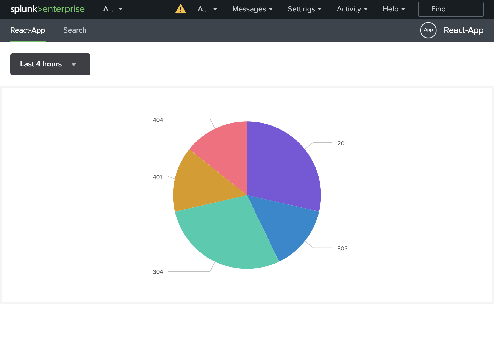

[](https://opensource.org/licenses/MIT)

# Splunk React MUI Boilerplate

Welcome to this boilerplate to quickly start [React](https://react.dev/) applications with [Splunk](https://www.splunk.com/). Use [Material-UI (MUI)](https://mui.com/) for the UI and
add no-code Splunk Dashboards to your app.



## Overview

- 🚀 [Quickstart](#quickstart)
- 🧐 [Notes](#notes)
- 💻 [Contribute to this repo](#how-to-contribute-to-this-repo)

## Quickstart

The simplest way to try out this boilerplate is to test it out locally. Here are the steps to get started.

### 1. Fork and clone repo

Fork the repo to your Github account, then run the following command to clone the repo:

```
git clone git@github.com:[YOUR_GITHUB_ACCOUNT_NAME]/splunk-react-boilerplate.git
```

Optionally, start the repository in a [Devcontainer](https://code.visualstudio.com/docs/devcontainers/containers). The one provided includes the necessary Node version 18, otherwise, [make sure that Node 18 is installed](https://nodejs.org/en/download).

### 2. Install dependencies

```
cd splunk-react-boilerplate
yarn install
```

### 3. Run app locally

a. **Start dev server**

```
yarn start
```

b. **Start Splunk**

```
docker-compose up
```

c. **Open Splunk in your browser**

http://localhost:8000/en-US/app/React-App/startPage

### 4. Build the Splunk app

You can use `yarn package` to build the app in a folder of your choice:

```
yarn package /tmp/React-App.tgz
```

If you push a tag, [a Github action](.github/workflows/release.yaml) will automatically build the app and upload it to [Github Releases](https://docs.github.com/en/repositories/releasing-projects-on-github/about-releases).

## Notes

This boilerplate is not using the [Splunk UI framework](https://splunkui.splunk.com/home), but instead uses [Material-UI (MUI)](https://mui.com/).

Nevertheless, this example contains a [simple Splunk dashboard](src/main/webapp/pages/app/src/dashboards/def1.json) that has been generated with the Splunk Dashboard Studio to show how to integrate dashboards into an MUI application.

The reasons for using MUI over Splunk UI are:

1.  Material-UI (MUI) is an incredibly popular set of React components that follow Google's Material Design guidelines. It is used by many companies and has a large community.
2.  MUI provides excellent customization capabilities. You can customize the design of your app by creating a theme and applying it to your components. In fact a lot of companies already have an existing MUI theme that they might want to use in their Splunk apps.

> Note: We're using [@splunk/dashboard](https://splunkui.splunk.com/Packages/dashboard-docs/) version 24, as 25 doesn't work with React 18.

## How to contribute to this repo

### Code contribution workflow

You can fork this repo, make changes, and create a pull request. Add **@marcusschiesser** as a reviewer.

If you are new to contributing on Github, here is a step-by-step guide:

1. Click on `Fork` on the top right of this page
2. Work on your change and push it to your forked repo. Now when you navigate to the forked repo's UI, you should see a "Contribute" button.
3. Click on "Contribute" -> "Open Pull Request".
4. Once you have a pull request, you can add reviewers.

### Other contributions

Feel free to open feature requests, bug reports, etc under Issues.
